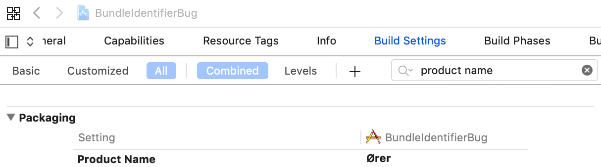

# apple-bug-bundle-identifier
Reproduces `[NSBundle bundleWithIdentifier]` crash with international characters in your app name.

## Repro Steps
```
git clone https://github.com/mikelehen/apple-bug-bundle-identifier.git
cd apple-bug-bundle-identifier
pod install
open BundleIdentifierBug.xcworkspace
```

Click play button to launch app.


## Result
```
thread #1, queue = 'com.apple.main-thread', stop reason = EXC_BAD_INSTRUCTION (code=EXC_I386_INVOP, subcode=0x0)
frame #0: 0x0000000110cf4692 CoreFoundation`CFRelease + 82
frame #1: 0x0000600002085d10
frame #2: 0x0000000110c82970 CoreFoundation`__CFBundleCopyFrameworkURLForExecutablePath + 896
frame #3: 0x0000000110c8061f CoreFoundation`_CFBundleEnsureBundleExistsForImagePath + 15
frame #4: 0x0000000110c8047d CoreFoundation`CFBundleGetBundleWithIdentifier + 221
frame #5: 0x000000010ed94551 Foundation`+[NSBundle bundleWithIdentifier:] + 26
frame #6: 0x000000010dd50c55 Ører`@nonobjc NSBundle.__allocating_init(identifier:) at <compiler-generated>:0
frame #7: 0x000000010dd50aab Ører`ViewController.viewDidLoad(self=0x00007fc04f516160) at ViewController.swift:15:9
frame #8: 0x000000010dd50d04 Ører`@objc ViewController.viewDidLoad() at <compiler-generated>:0
frame #9: 0x0000000112f3143b UIKitCore`-[UIViewController loadViewIfRequired] + 1183
frame #10: 0x0000000112f31868 UIKitCore`-[UIViewController view] + 27
```

## The Issue
If you change your Build Settings > Packaging > Product Name to certain strings containing international characters, e.g. `Ører` then `[NSBundle bundleWithIdentifier]` crashes with the above callstack.



It's worth noticing that when you change your package name to `Ører` then your app ends up installing to a `Ører.app/` folder on disk.  Presumably there's a bug with constructing file paths or something.
